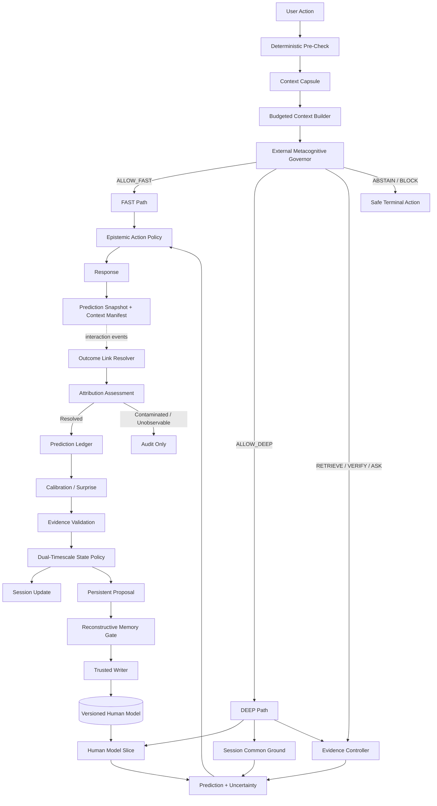

# RFC-001: MindForge — A Resource-Rational, Evidence-Calibrated Architecture for Longitudinal Human–AI Collaboration

**Status:** Research RFC / Architectural Specification  
**Version:** 1.0  
**Date:** 2026-09-17  
**Category:** AI Systems, Human–AI Interaction, Longitudinal Adaptation  
**Intended audience:** AI systems researchers, ML engineers, HCI researchers, academic faculty, and technical reviewers  
**Repository role:** Canonical technical RFC for the current MindForge architecture

---

## Abstract

MindForge is a research architecture for longitudinal human–AI collaboration. It studies whether an AI system can maintain explicit, inspectable, and revisable beliefs about an individual; make falsifiable predictions from those beliefs; resolve delayed outcomes; evaluate its own calibration; and adapt assistance under bounded compute while preserving human autonomy.

The architecture separates **cognitive control** from **model execution**. A foundation model may propose content or reasoning, but it does not possess metacognitive authority over routing, persistent memory writes, evidence sufficiency, or safety-critical escalation. These decisions are mediated by an external governance layer operating on typed state, empirical competence estimates, evidence provenance, and resource constraints.

MindForge further separates short-lived session state from persistent user beliefs, validates retrieved memory before reuse, logs predictions before outcomes are known, and resolves delayed outcomes through an auditable event system. Its first empirical testbed is adaptive STEM/DSA learning because that domain permits repeated interaction, objective task outcomes, delayed retention testing, and measurable assistance dependence.

This RFC is an **architectural and research specification**, not a claim that MindForge is generally superior to conventional assistants, not a completed large-scale evaluation, and not a claim of AGI, consciousness, brain simulation, or novel transformer internals. The central claims are explicitly falsifiable and are intended to be tested against strong baselines.

---

# 1. Executive Summary & Problem Formulation

## 1.1 Problem

Most production LLM interaction systems are optimized for a single turn or a short conversational horizon. Longitudinal collaboration introduces a different systems problem: the model must use historical information without silently converting temporary states into permanent traits, must adapt when prior assumptions become invalid, and must distinguish confidence in generated language from empirically demonstrated competence.

Three common approaches are insufficient on their own.

### Sliding-window conversational context

A sliding window can preserve recent text, but it does not provide a typed, inspectable representation of what the system believes about a user or why. Older observations disappear as the window advances, while recent but anomalous observations may receive disproportionate weight.

A temporary event such as:

> “I am exhausted today.”

must not silently become:

> “This user has persistently low energy.”

This RFC treats the distinction as an invariant:

> **State ≠ Trait.**

### Stateless or indiscriminate retrieval

Retrieval-Augmented Generation can ground a response in external information, but retrieval alone does not determine whether a retrieved memory remains valid for the current state. A previously useful episode can produce **negative transfer** if replayed under incompatible conditions. MindForge therefore treats memory as a candidate for reconstruction and validation rather than as text to be blindly replayed.

### Unconstrained long-term agent memory

Agent memory systems often permit generated summaries, inferred preferences, or previous model outputs to become future context. Without provenance, confidence, scope, versioning, and conflict handling, an early inference can recursively reinforce itself.

A user model that begins with an incorrect assumption can become more confident merely because the assumption is repeatedly re-read.

MindForge instead requires persistent state to be:
- typed;
- scoped;
- provenance-linked;
- versioned;
- updateable through explicit policies;
- auditable;
- correctable.

### Model self-confidence is not metacognitive authority

Language models can verbalize confidence or uncertainty, but a model's own self-report is not treated as sufficient authority to decide that:
- it is competent for a task;
- evidence is sufficient;
- a persistent state write is warranted;
- a high-risk answer may proceed;
- a cheaper route is adequate.

MindForge places these decisions in an **External Metacognitive Governor** operating outside the generative model.

> **Model self-confidence is NOT metacognitive authority.**

---

## 1.2 Core research thesis

MindForge investigates the following falsifiable thesis:

> **Compared with a strong conversational-memory baseline using the same underlying foundation model, an architecture that maintains explicit and revisable user beliefs, governs model authority externally, logs probabilistic predictions before outcomes, calibrates those predictions against observed outcomes, and separates short- from long-timescale adaptation can improve longitudinal adaptation and/or human autonomy without exceeding predefined compute and latency budgets.**

The thesis fails in its current form if a strong conventional baseline achieves equivalent longitudinal outcomes and calibration at lower architectural complexity or materially lower cost.

The research goal is therefore **not to preserve MindForge's complexity**. The architecture is expected to become smaller if ablations show that a subsystem does not contribute measurable value.

---

## 1.3 Core invariants

MindForge adopts the following epistemic and systems invariants:

```text
Fact ≠ Belief
Belief ≠ Inference
Inference ≠ Diagnosis
Prediction ≠ Truth
State ≠ Trait
Confidence ≠ Competence
Memory ≠ Current Reality
User Self-Report ≠ Objective Performance
Retrieved Information ≠ Truth
No Evidence ≠ Permission To Guess
High Engagement ≠ Successful Collaboration
```

Research invariants:

```text
Elegant Theory ≠ Valid Theory
Implementation Success ≠ Real-World Effectiveness
Tests Passed ≠ Hypothesis Confirmed
Positive Metric ≠ Causal Evidence
Negative Result ≠ Failed Research
Researcher Belief ≠ Experimental Result
```

---

## 1.4 Scope and non-goals

MindForge is a **domain-agnostic control architecture**. The initial Learning Workspace is a domain adapter and empirical testbed, not the definition of MindForge.

MindForge does not claim:
- AGI;
- consciousness;
- human-like subjective experience;
- brain simulation;
- mind reading;
- psychological diagnosis;
- universal correctness of a Human Model;
- direct implementation of FlashAttention, Mamba, PonderNet, or neural Mixture-of-Experts unless such mechanisms are actually implemented at the model-runtime level;
- general superiority before empirical evaluation.

---

# 2. Theoretical Framework & Mathematical Foundations

## 2.1 Typed belief interface

Let the persistent Human Model at time \(t\) be:

\[
\mathcal{H}_t = \{b_1, b_2, \ldots, b_n\}
\]

where each belief \(b\) is scoped to a domain, property, evidence provenance, and a **belief family**.

MindForge does not force every human-state variable into one statistical distribution. The generic interface is:

\[
B_{t+1} = U(B_t, E_t, R_t, S_t, C_t)
\]

where:

- \(B_t\): prior belief state;
- \(E_t\): new evidence;
- \(R_t\): reliability or evidential weight;
- \(S_t\): evidence source/provenance;
- \(C_t\): context and scope.

A belief implementation must expose conceptually equivalent operations:

```text
predict()
update(evidence)
uncertainty()
surprise(outcome)
decay(delta_t)
detect_conflict()
```

Candidate belief families include:

| Belief family | Example | Candidate representation |
|---|---|---|
| Binary | succeeds without hint | Beta/Bernoulli |
| Categorical | preferred explanation format | Dirichlet/Categorical |
| Continuous | task completion time | Gaussian or robust EMA with variance |
| Ordinal | scaffolding level | ordered categorical |
| Deterministic | explicitly selected UI language | validated fixed value |

The Domain Adapter determines which family is appropriate.

---

## 2.2 Discounted Beta-Bernoulli example

For a binary outcome \(y_t \in \{0,1\}\), define a Beta belief:

\[
p_t \sim \mathrm{Beta}(\alpha_t,\beta_t)
\]

with base prior \((\alpha_0,\beta_0)\).

The posterior mean is:

\[
\hat p_t = \frac{\alpha_t}{\alpha_t+\beta_t}
\]

and the Beta posterior variance is:

\[
\mathrm{Var}(p_t)
=
\frac{\alpha_t\beta_t}
{(\alpha_t+\beta_t)^2(\alpha_t+\beta_t+1)}
\]

### Time discounting

To avoid treating old observations as permanently equivalent to current evidence, a domain policy may discount accumulated evidence toward the base prior.

Let:

\[
\rho(\Delta t)=e^{-\kappa\Delta t},\quad \kappa \ge 0
\]

Then:

\[
\alpha^-_t
=
\alpha_0
+
\rho(\Delta t)(\alpha_{t-1}-\alpha_0)
\]

\[
\beta^-_t
=
\beta_0
+
\rho(\Delta t)(\beta_{t-1}-\beta_0)
\]

### Reliability-weighted update

For evidence weight \(w_t \in [0,1]\):

\[
\alpha_t
=
\alpha^-_t+w_ty_t
\]

\[
\beta_t
=
\beta^-_t+w_t(1-y_t)
\]

When \(w_t\) is fractional and time discounting is used, this should be interpreted as a **discounted pseudo-count model**, not as a claim of exact textbook Bayesian conjugacy under a stationary generative process.

The values of \(\kappa\) and \(w_t\) are domain-policy parameters that require validation. They are not universal constants.

---

## 2.3 Prediction Ledger

A central MindForge mechanism is that a prediction is recorded **before** its outcome is known.

For binary outcome \(y_i\) and predicted probability \(\hat p_i\), the Brier Score is:

\[
BS
=
\frac{1}{N}
\sum_{i=1}^{N}
(\hat p_i-y_i)^2
\]

Lower is better.

The binary log loss is:

\[
LL
=
-\frac{1}{N}
\sum_{i=1}^{N}
\left[
y_i\log(\hat p_i)
+
(1-y_i)\log(1-\hat p_i)
\right]
\]

with implementation-level clipping:

\[
\hat p_i
\leftarrow
\min(1-\epsilon,\max(\epsilon,\hat p_i))
\]

to prevent numerical divergence at 0 and 1.

Prediction records may end in one of the following states:

```text
PENDING
RESOLVED
EXPIRED
UNOBSERVABLE
CONTAMINATED
INVALIDATED
```

Only outcomes that satisfy the study's attribution requirements enter the primary calibration analysis.

---

## 2.4 Prediction error and contradiction gate

A simple absolute prediction error is:

\[
PE_t = |y_t-\hat p_t|
\]

but MindForge does not treat a fixed `PE > threshold` rule as a universal definition of contradiction.

For binary outcomes, define predictive surprise:

\[
S_t
=
-\log
\left(
P(y_t\mid B_t)+\epsilon
\right)
\]

where:

\[
P(y_t=1\mid B_t)=\hat p_t,\qquad
P(y_t=0\mid B_t)=1-\hat p_t
\]

A contradiction candidate is raised only when all of the following hold:

\[
\mathrm{Contradiction}_t =
\mathbb{1}
[
S_t \ge \tau_S
\land
r_t \ge \tau_R
\land
a_t \ge \tau_A
\land
n^{eff}_t \ge n_{min}
]
\]

where:

- \(r_t\): evidence reliability;
- \(a_t\): outcome-attribution confidence;
- \(n^{eff}_t\): effective evidence mass for the belief;
- \(\tau_S,\tau_R,\tau_A,n_{min}\): **pre-registered policy parameters**, calibrated during pre-pilot/alpha work.

The gate does **not** prohibit normal belief updates when surprise is low. Valid evidence may reinforce an already accurate belief.

A contradiction triggers:
- uncertainty review;
- competing-hypothesis reopening;
- potential DEEP routing;
- possible memory quarantine;
- not automatic deletion of the prior belief.

---

## 2.5 Empirical competence boundary

Model or module competence is task-conditional rather than universal.

For an actor \(a\) and task class \(k\):

\[
c_{a,k}\sim\mathrm{Beta}(\alpha_{a,k},\beta_{a,k})
\]

with posterior mean:

\[
\hat c_{a,k}
=
\frac{\alpha_{a,k}}
{\alpha_{a,k}+\beta_{a,k}}
\]

and variance:

\[
\sigma^2_{a,k}
=
\frac{\alpha_{a,k}\beta_{a,k}}
{(\alpha_{a,k}+\beta_{a,k})^2
(\alpha_{a,k}+\beta_{a,k}+1)}
\]

The Governor may use a conservative routing statistic such as:

\[
c^{LCB}_{a,k}
=
\max(0,\hat c_{a,k}-z\sigma_{a,k})
\]

where \(z\) is a policy parameter.

This quantity is an **engineering confidence bound heuristic**, not an assertion of true competence.

A competence profile also tracks:
- sample count;
- actor/model version;
- tool configuration;
- recent drift;
- confident failures;
- evaluation window.

Possible states:

```text
UNKNOWN
HIGH_UNCERTAINTY
LOW_MATURE
HIGH_MATURE
DRIFTING
```

---

## 2.6 Multidimensional autonomy vector

MindForge treats human autonomy as multidimensional.

For evaluation window \(t\):

\[
\vec A_t
=
[
A_{\mathrm{ind}},
A_{\mathrm{hint}},
A_{\mathrm{self}},
A_{\mathrm{cal}}
]
\]

where:

### Independent success

\[
A_{\mathrm{ind}}
=
\frac{\text{unassisted successful tasks}}
{\text{eligible unassisted tasks}}
\]

### Hint independence

Let:

\[
H_t
=
\frac{\text{hints consumed}}
{\text{eligible hint opportunities}}
\]

Then:

\[
A_{\mathrm{hint}}=1-H_t
\]

Longitudinal hint decay is evaluated using the slope of \(H_t\) over repeated sessions or task windows rather than one isolated ratio.

### Self-correction

\[
A_{\mathrm{self}}
=
\frac{\text{errors corrected before AI intervention}}
{\text{correctable errors}}
\]

### User confidence calibration

For binned confidence predictions, define:

\[
A_{\mathrm{cal}}
=
1-\mathrm{ECE}_{user}
\]

when ECE is estimable with adequate data. With sparse per-user observations, raw calibration error and confidence/accuracy pairs should be reported instead of overinterpreting ECE.

### Why no unconstrained scalar objective

MindForge does not optimize:

\[
\|\vec A_t\|
\]

as a universal objective. A scalar norm can hide harmful trade-offs—for example, a large gain in independent completion could numerically offset degraded delayed retention.

The primary analysis therefore reports:
- dimension-wise trajectories;
- confidence intervals;
- trade-offs;
- delayed independent performance.

A composite autonomy score is permitted only if its weights and interpretation are theoretically justified and preregistered.

---

## 2.7 Value of Deliberation

MindForge routes between FAST and DEEP processing using a resource-rational decision model.

Let \(x_t\) denote the current decision state. Conceptually:

\[
\mathrm{VoD}(x_t)
=
\mathbb{E}
[
L_{\mathrm{FAST}}-L_{\mathrm{DEEP}}
\mid x_t
]
-
\lambda_C C_t
-
\lambda_T T_t
-
\lambda_F F_t
\]

where:

- \(L\): expected decision loss;
- \(C_t\): additional compute/API cost;
- \(T_t\): additional latency;
- \(F_t\): additional user friction.

A simplified policy is:

\[
\mathrm{route}(x_t)
=
\begin{cases}
DEEP,& \mathrm{VoD}(x_t)>0\\
FAST,& \mathrm{VoD}(x_t)\le 0
\end{cases}
\]

subject to Governor constraints.

In the MVP, MindForge does **not** claim to know the true expected loss terms. Initial routing is a calibrated deterministic policy over:
- uncertainty;
- task novelty;
- evidence conflict;
- risk;
- Human Model dependence;
- competence;
- budget.

Routing outcomes are logged for later evaluation or possible policy learning.

---

# 3. Systems Architecture: Decoupled Dual-Path Execution

## 3.1 Design principle

The latency-critical response path is separated from longitudinal learning.

The user should not wait for:
- Brier aggregation;
- persistent-state consolidation;
- historical competence updates;
- event folding;
- cross-session memory promotion.

Those operations are handled asynchronously.

At the same time, asynchronous state mutation must not introduce race conditions, lost updates, or stale overwrites.

---

## 3.2 ASCII architecture

```text
======================== SYNCHRONOUS CRITICAL PATH ========================

                              USER ACTION
                                   │
                                   ▼
                        Deterministic Pre-Check
                    safety / schema / rate / budget
                                   │
                                   ▼
                           Context Capsule
                                   │
                                   ▼
                     Budgeted Context Builder
                                   │
                                   ▼
                  External Metacognitive Governor
                     │          │          │
                     │          │          ├── REQUIRE_RETRIEVAL
                     │          │          ├── REQUIRE_VERIFICATION
                     │          │          ├── REQUIRE_CLARIFICATION
                     │          │          ├── ABSTAIN
                     │          │          └── BLOCK
                     │          │
               ALLOW_FAST   ALLOW_DEEP
                     │          │
                     │          ▼
                     │   Human Model Slice
                     │   Session Common Ground
                     │   Evidence Controller
                     │   Competence Boundary
                     │          │
                     │          ▼
                     │   Prediction + Uncertainty
                     │          │
                     └────┬─────┘
                          ▼
                 Epistemic Action Policy
       ANSWER / HINT / PROBE / ASK / RETRIEVE /
          VERIFY / COMPARE / WAIT / ABSTAIN
                          │
                          ▼
                     Response Policy
                          │
                          ▼
                        OUTPUT
                          │
                          ├── Prediction Snapshot
                          └── Context Manifest Hash


======================= ASYNCHRONOUS LEARNING PATH =======================

                     IMMUTABLE INTERACTION EVENT
                                   │
                                   ▼
                         Outcome Link Resolver
                                   │
                                   ▼
                         Attribution Assessment
                        /          │           \
                       /           │            \
                 RESOLVED     CONTAMINATED   UNOBSERVABLE
                       │
                       ▼
                 Prediction Ledger Audit
             Brier / Log Loss / Residuals
                       │
                       ▼
                Evidence Validation
                       │
                       ▼
              Dual-Timescale State Policy
                /                    \
       Session Common Ground      Persistent Proposal
                                      │
                                      ▼
                          Reconstructive Memory Gate
                                      │
                                      ▼
                                Trusted Writer
                          OCC + idempotent commit
                                      │
                                      ▼
                           Versioned Human Model
                                      │
                                      ├── Competence update
                                      └── Event/telemetry record
```

---

## 3.3 Mermaid architecture



---

## 3.4 Dual-timescale co-adaptation

MindForge explicitly separates:

### Session Common Ground

Short-lived:
- current task;
- temporary confusion;
- recent hint chain;
- transient stall;
- local communication strategy;
- active constraints.

### Persistent Human Model

Long-lived:
- demonstrated capability;
- repeated misconception;
- durable contextual preference;
- cross-session calibration state;
- verified longitudinal patterns.

Promotion is not automatic.

```text
Session observation
       │
       ▼
Repeated / reliable?
       │
       ▼
Scope consistent?
       │
       ▼
Contradiction-free?
       │
       ▼
Persistent proposal
       │
       ▼
Trusted Writer
```

This implements the invariant:

> **State ≠ Trait.**

---

## 3.5 Reconstructive memory

Retrieved memory is treated as a hypothesis-bearing artifact, not an instruction.

Possible decisions:

```text
USE
CONTEXTUALIZE
VERIFY
QUARANTINE
REJECT
```

The MVP uses metadata-first deterministic checks. LLM-based memory reconstruction is reserved for cases where the retrieved memory materially changes a high-stakes or highly uncertain decision.

> **Memory is reconstructed and validated, not blindly replayed.**

---

## 3.6 Decoupled execution

MindForge does not require a particular provider or execution framework.

```text
MindForge Core
      │
      ▼
Executor Interface
      ├── Lightweight Async Research Runner
      └── Javis Adapter
              │
              ▼
      Providers / Tools / MCP / Jobs
```

> **MindForge determines cognitive actions; execution infrastructure performs API/tool calls.**

This boundary allows the research core to remain reproducible even if Javis OS, a model provider, or a tool stack changes.

---

# 4. Concrete Engineering Contracts — Python 3.11 + Pydantic v2

The following contracts are designed as reference implementations for the headless core. They are intentionally provider-agnostic.

---

## 4.1 `ContextManifest`

The runtime should not persist an entire reconstructed prompt for every turn by default. Instead, it stores a compact manifest sufficient to identify the decision state and reproduce it when underlying versioned artifacts remain available.

```python
from __future__ import annotations

from datetime import datetime, timezone
from hashlib import sha256
import json
from typing import Any
from uuid import UUID, uuid4

from pydantic import BaseModel, ConfigDict, Field


class ContextManifest(BaseModel):
    """
    Lightweight reproducibility record.

    Raw conversation text does not need to be duplicated here. The manifest
    identifies the versions and evidence that produced the effective context.
    """

    model_config = ConfigDict(frozen=True)

    manifest_id: UUID = Field(default_factory=uuid4)
    user_id: UUID
    session_id: UUID
    task_id: str | None = None

    input_hash: str
    human_model_version: int = Field(ge=0)
    session_state_version: int = Field(ge=0)

    evidence_ids: tuple[str, ...] = ()
    active_belief_ids: tuple[UUID, ...] = ()

    task_version: str
    policy_version: str
    actor_id: str
    actor_version: str
    retrieval_version: str | None = None

    selected_feature_keys: tuple[str, ...] = ()
    created_at: datetime = Field(
        default_factory=lambda: datetime.now(timezone.utc)
    )

    manifest_hash: str

    @staticmethod
    def hash_text(text: str) -> str:
        return sha256(text.encode("utf-8")).hexdigest()

    @classmethod
    def build(
        cls,
        *,
        user_id: UUID,
        session_id: UUID,
        user_input: str,
        human_model_version: int,
        session_state_version: int,
        task_version: str,
        policy_version: str,
        actor_id: str,
        actor_version: str,
        task_id: str | None = None,
        evidence_ids: tuple[str, ...] = (),
        active_belief_ids: tuple[UUID, ...] = (),
        retrieval_version: str | None = None,
        selected_feature_keys: tuple[str, ...] = (),
    ) -> "ContextManifest":
        manifest_id = uuid4()
        created_at = datetime.now(timezone.utc)

        payload: dict[str, Any] = {
            "manifest_id": str(manifest_id),
            "user_id": str(user_id),
            "session_id": str(session_id),
            "task_id": task_id,
            "input_hash": cls.hash_text(user_input),
            "human_model_version": human_model_version,
            "session_state_version": session_state_version,
            "evidence_ids": list(evidence_ids),
            "active_belief_ids": [str(x) for x in active_belief_ids],
            "task_version": task_version,
            "policy_version": policy_version,
            "actor_id": actor_id,
            "actor_version": actor_version,
            "retrieval_version": retrieval_version,
            "selected_feature_keys": list(selected_feature_keys),
            "created_at": created_at.isoformat(),
        }

        canonical = json.dumps(
            payload,
            sort_keys=True,
            separators=(",", ":"),
            ensure_ascii=False,
        ).encode("utf-8")

        manifest_hash = sha256(canonical).hexdigest()

        return cls(
            manifest_id=manifest_id,
            user_id=user_id,
            session_id=session_id,
            task_id=task_id,
            input_hash=payload["input_hash"],
            human_model_version=human_model_version,
            session_state_version=session_state_version,
            evidence_ids=evidence_ids,
            active_belief_ids=active_belief_ids,
            task_version=task_version,
            policy_version=policy_version,
            actor_id=actor_id,
            actor_version=actor_version,
            retrieval_version=retrieval_version,
            selected_feature_keys=selected_feature_keys,
            created_at=created_at,
            manifest_hash=manifest_hash,
        )
```

Security note: a SHA-256 digest is an integrity/reproducibility identifier, **not an anonymization guarantee**. Sensitive low-entropy text can still be vulnerable to guessing attacks. Raw-content retention remains governed by privacy and consent policy.

---

## 4.2 `CompetenceProfile`

Competence is scoped to actor version, task class, domain, and tool configuration.

```python
from __future__ import annotations

from math import sqrt
from typing import Self

from pydantic import BaseModel, ConfigDict, Field


class CompetenceProfile(BaseModel):
    """
    Empirical competence estimate for a specific actor/task scope.

    This does not represent a universal ability score.
    """

    model_config = ConfigDict(frozen=True)

    actor_id: str
    actor_version: str
    task_class: str
    domain: str
    tool_config_hash: str

    alpha: float = Field(default=1.0, gt=0.0)
    beta: float = Field(default=1.0, gt=0.0)

    total_evaluated: int = Field(default=0, ge=0)
    confident_failures: int = Field(default=0, ge=0)

    @property
    def posterior_mean(self) -> float:
        return self.alpha / (self.alpha + self.beta)

    @property
    def posterior_variance(self) -> float:
        a = self.alpha
        b = self.beta
        return (a * b) / (((a + b) ** 2) * (a + b + 1.0))

    @property
    def posterior_std(self) -> float:
        return sqrt(self.posterior_variance)

    def conservative_score(self, z: float = 1.0) -> float:
        """
        Heuristic lower-confidence routing score.

        This is deliberately not described as an exact credible bound.
        """
        return max(0.0, self.posterior_mean - z * self.posterior_std)

    def is_mature(self, *, min_evaluated: int) -> bool:
        return self.total_evaluated >= min_evaluated

    def record_outcome(
        self,
        *,
        success: bool,
        evidence_weight: float = 1.0,
        confident_failure: bool = False,
    ) -> Self:
        if not 0.0 <= evidence_weight <= 1.0:
            raise ValueError("evidence_weight must be in [0, 1]")

        return self.model_copy(
            update={
                "alpha": self.alpha + (evidence_weight if success else 0.0),
                "beta": self.beta + (evidence_weight if not success else 0.0),
                "total_evaluated": self.total_evaluated + 1,
                "confident_failures": (
                    self.confident_failures
                    + int((not success) and confident_failure)
                ),
            }
        )
```

A minimum sample count is a routing policy parameter, not a scientific constant. The main pilot must freeze that policy before treatment data are inspected.

---

## 4.3 `ExternalMetacognitiveGovernor`

The Governor never accepts an LLM's verbalized confidence as metacognitive authority.

```python
from __future__ import annotations

from enum import Enum
from pydantic import BaseModel, Field


class GovernorDecision(str, Enum):
    ALLOW_FAST = "ALLOW_FAST"
    ALLOW_DEEP = "ALLOW_DEEP"
    REQUIRE_CLARIFICATION = "REQUIRE_CLARIFICATION"
    REQUIRE_RETRIEVAL = "REQUIRE_RETRIEVAL"
    REQUIRE_VERIFICATION = "REQUIRE_VERIFICATION"
    ABSTAIN = "ABSTAIN"
    BLOCK = "BLOCK"


class GovernorInput(BaseModel):
    task_risk: float = Field(ge=0.0, le=1.0)
    evidence_sufficiency: float = Field(ge=0.0, le=1.0)

    competence_score: float | None = Field(default=None, ge=0.0, le=1.0)
    competence_mature: bool = False

    unresolved_contradictions: int = Field(default=0, ge=0)

    budget_remaining_usd: float = Field(ge=0.0)
    estimated_fast_cost_usd: float = Field(ge=0.0)
    estimated_deep_cost_usd: float = Field(ge=0.0)

    retrieval_available: bool = True
    verification_available: bool = True

    safety_block: bool = False
    hard_policy_violation: bool = False


class GovernorResult(BaseModel):
    decision: GovernorDecision
    reasons: tuple[str, ...]


class ExternalMetacognitiveGovernor:
    """
    Small deterministic policy engine.

    Thresholds are versioned engineering policy, not universal constants.
    """

    def __init__(
        self,
        *,
        high_risk_threshold: float = 0.80,
        low_risk_threshold: float = 0.30,
        sufficient_evidence_threshold: float = 0.75,
        fast_competence_threshold: float = 0.75,
    ) -> None:
        self.high_risk_threshold = high_risk_threshold
        self.low_risk_threshold = low_risk_threshold
        self.sufficient_evidence_threshold = sufficient_evidence_threshold
        self.fast_competence_threshold = fast_competence_threshold

    def evaluate(self, state: GovernorInput) -> GovernorResult:
        if state.safety_block or state.hard_policy_violation:
            return GovernorResult(
                decision=GovernorDecision.BLOCK,
                reasons=("hard safety or policy constraint",),
            )

        if state.task_risk >= self.high_risk_threshold:
            if state.evidence_sufficiency < self.sufficient_evidence_threshold:
                if state.verification_available:
                    return GovernorResult(
                        decision=GovernorDecision.REQUIRE_VERIFICATION,
                        reasons=(
                            "high-risk task",
                            "evidence below required sufficiency",
                        ),
                    )
                return GovernorResult(
                    decision=GovernorDecision.ABSTAIN,
                    reasons=(
                        "high-risk task",
                        "insufficient evidence",
                        "verification unavailable",
                    ),
                )

        if state.unresolved_contradictions > 0:
            if state.verification_available:
                return GovernorResult(
                    decision=GovernorDecision.REQUIRE_VERIFICATION,
                    reasons=("unresolved model/evidence contradiction",),
                )
            return GovernorResult(
                decision=GovernorDecision.ALLOW_DEEP,
                reasons=(
                    "unresolved contradiction",
                    "verification unavailable",
                    "deeper reasoning required",
                ),
            )

        if state.evidence_sufficiency < self.sufficient_evidence_threshold:
            if state.retrieval_available:
                return GovernorResult(
                    decision=GovernorDecision.REQUIRE_RETRIEVAL,
                    reasons=("evidence insufficient for current action",),
                )
            return GovernorResult(
                decision=GovernorDecision.REQUIRE_CLARIFICATION,
                reasons=(
                    "evidence insufficient",
                    "retrieval unavailable",
                ),
            )

        if state.budget_remaining_usd < state.estimated_fast_cost_usd:
            return GovernorResult(
                decision=GovernorDecision.ABSTAIN,
                reasons=("insufficient budget for minimum safe execution",),
            )

        competence_known = (
            state.competence_score is not None
            and state.competence_mature
        )

        if (
            competence_known
            and state.competence_score >= self.fast_competence_threshold
            and state.task_risk <= self.low_risk_threshold
        ):
            return GovernorResult(
                decision=GovernorDecision.ALLOW_FAST,
                reasons=(
                    "low-risk task",
                    "mature empirical competence above FAST threshold",
                    "evidence sufficient",
                ),
            )

        if state.budget_remaining_usd >= state.estimated_deep_cost_usd:
            return GovernorResult(
                decision=GovernorDecision.ALLOW_DEEP,
                reasons=(
                    "FAST authority not established",
                    "DEEP route affordable",
                ),
            )

        return GovernorResult(
            decision=GovernorDecision.ALLOW_FAST,
            reasons=(
                "DEEP route exceeds budget",
                "FAST route remains within budget",
                "caller must preserve uncertainty in response",
            ),
        )
```

The final fallback above is permissible only for non-high-risk tasks that have already passed the earlier evidence and safety checks. Policy order is therefore part of the safety contract.

---

## 4.4 `ReconstructiveMemoryGate`

The gate is metadata-first and does not add an LLM call by default.

```python
from __future__ import annotations

from datetime import datetime, timezone
from enum import Enum

from pydantic import BaseModel, Field


class MemoryDecision(str, Enum):
    USE = "USE"
    CONTEXTUALIZE = "CONTEXTUALIZE"
    VERIFY = "VERIFY"
    QUARANTINE = "QUARANTINE"
    REJECT = "REJECT"


class MemoryCandidate(BaseModel):
    memory_id: str
    domain: str
    scope: str
    status: str
    provenance: str | None = None

    created_at: datetime
    last_verified_at: datetime | None = None
    expires_at: datetime | None = None

    contradicted_by_current_evidence: bool = False
    reliability: float = Field(default=0.5, ge=0.0, le=1.0)


class MemoryContext(BaseModel):
    domain: str
    scope: str
    minimum_reliability: float = Field(default=0.5, ge=0.0, le=1.0)
    high_stakes: bool = False


class MemoryGateResult(BaseModel):
    decision: MemoryDecision
    reasons: tuple[str, ...]


class ReconstructiveMemoryGate:
    def evaluate(
        self,
        candidate: MemoryCandidate,
        context: MemoryContext,
    ) -> MemoryGateResult:
        now = datetime.now(timezone.utc)

        if candidate.status in {"REJECTED", "INVALIDATED"}:
            return MemoryGateResult(
                decision=MemoryDecision.REJECT,
                reasons=("memory status prohibits reuse",),
            )

        if candidate.expires_at is not None and candidate.expires_at <= now:
            return MemoryGateResult(
                decision=MemoryDecision.QUARANTINE,
                reasons=("memory expired",),
            )

        if candidate.contradicted_by_current_evidence:
            return MemoryGateResult(
                decision=(
                    MemoryDecision.VERIFY
                    if context.high_stakes
                    else MemoryDecision.QUARANTINE
                ),
                reasons=("current evidence contradicts retrieved memory",),
            )

        if candidate.provenance is None:
            return MemoryGateResult(
                decision=MemoryDecision.VERIFY,
                reasons=("missing provenance",),
            )

        if candidate.reliability < context.minimum_reliability:
            return MemoryGateResult(
                decision=MemoryDecision.VERIFY,
                reasons=("memory reliability below policy threshold",),
            )

        if candidate.domain != context.domain:
            return MemoryGateResult(
                decision=MemoryDecision.REJECT,
                reasons=("domain mismatch",),
            )

        if candidate.scope != context.scope:
            return MemoryGateResult(
                decision=MemoryDecision.CONTEXTUALIZE,
                reasons=("scope mismatch requires explicit qualification",),
            )

        return MemoryGateResult(
            decision=MemoryDecision.USE,
            reasons=("memory satisfies current metadata constraints",),
        )
```

---

## 4.5 `PredictionLedgerManager`

The manager returns immutable ledger events. Resolution does not mutate the original prediction record.

```python
from __future__ import annotations

from datetime import datetime, timezone
from enum import Enum
from math import log
from uuid import UUID, uuid4

from pydantic import BaseModel, ConfigDict, Field


class PredictionStatus(str, Enum):
    PENDING = "PENDING"
    RESOLVED = "RESOLVED"
    EXPIRED = "EXPIRED"
    UNOBSERVABLE = "UNOBSERVABLE"
    CONTAMINATED = "CONTAMINATED"
    INVALIDATED = "INVALIDATED"


class PredictionCreated(BaseModel):
    model_config = ConfigDict(frozen=True)

    prediction_id: UUID = Field(default_factory=uuid4)
    user_id: UUID
    task_id: str
    attempt_id: UUID | None = None
    action_id: UUID | None = None
    context_manifest_id: UUID

    actor_id: str
    actor_version: str
    human_model_version: int = Field(ge=0)

    target: str
    predicted_probability: float = Field(ge=0.0, le=1.0)
    uncertainty: float = Field(ge=0.0)
    evidence_quality: float = Field(ge=0.0, le=1.0)

    created_at: datetime = Field(
        default_factory=lambda: datetime.now(timezone.utc)
    )
    expires_at: datetime

    status: PredictionStatus = PredictionStatus.PENDING


class PredictionResolved(BaseModel):
    model_config = ConfigDict(frozen=True)

    resolution_id: UUID = Field(default_factory=uuid4)
    prediction_id: UUID
    status: PredictionStatus

    observed_outcome: float | None = Field(
        default=None,
        ge=0.0,
        le=1.0,
    )
    attribution_confidence: float = Field(ge=0.0, le=1.0)

    brier_contribution: float | None = None
    log_loss_contribution: float | None = None

    resolved_at: datetime = Field(
        default_factory=lambda: datetime.now(timezone.utc)
    )
    reason: str


class PredictionLedgerManager:
    def __init__(
        self,
        *,
        primary_attribution_threshold: float = 0.80,
        epsilon: float = 1e-12,
    ) -> None:
        if not 0.0 <= primary_attribution_threshold <= 1.0:
            raise ValueError(
                "primary_attribution_threshold must be in [0, 1]"
            )
        self.primary_attribution_threshold = (
            primary_attribution_threshold
        )
        self.epsilon = epsilon

    def resolve(
        self,
        *,
        prediction: PredictionCreated,
        outcome: float | None,
        attribution_confidence: float,
        observable: bool = True,
        contaminated: bool = False,
        now: datetime | None = None,
    ) -> PredictionResolved:
        now = now or datetime.now(timezone.utc)

        if contaminated:
            return PredictionResolved(
                prediction_id=prediction.prediction_id,
                status=PredictionStatus.CONTAMINATED,
                attribution_confidence=attribution_confidence,
                reason="external or ambiguous intervention contaminated attribution",
            )

        if not observable:
            return PredictionResolved(
                prediction_id=prediction.prediction_id,
                status=PredictionStatus.UNOBSERVABLE,
                attribution_confidence=attribution_confidence,
                reason="outcome could not be observed reliably",
            )

        if now > prediction.expires_at:
            return PredictionResolved(
                prediction_id=prediction.prediction_id,
                status=PredictionStatus.EXPIRED,
                attribution_confidence=attribution_confidence,
                reason="outcome arrived outside prediction validity window",
            )

        if outcome is None:
            raise ValueError(
                "outcome is required for an observable, unexpired resolution"
            )

        if not 0.0 <= outcome <= 1.0:
            raise ValueError("outcome must be in [0, 1]")

        p = prediction.predicted_probability

        if attribution_confidence < self.primary_attribution_threshold:
            return PredictionResolved(
                prediction_id=prediction.prediction_id,
                status=PredictionStatus.CONTAMINATED,
                observed_outcome=outcome,
                attribution_confidence=attribution_confidence,
                reason="attribution below primary-analysis threshold",
            )

        brier = (p - outcome) ** 2

        clipped_p = min(
            1.0 - self.epsilon,
            max(self.epsilon, p),
        )

        log_loss = -(
            outcome * log(clipped_p)
            + (1.0 - outcome) * log(1.0 - clipped_p)
        )

        return PredictionResolved(
            prediction_id=prediction.prediction_id,
            status=PredictionStatus.RESOLVED,
            observed_outcome=outcome,
            attribution_confidence=attribution_confidence,
            brier_contribution=brier,
            log_loss_contribution=log_loss,
            reason="resolved with sufficient attribution confidence",
        )
```

In production, the returned `PredictionResolved` object is appended to the immutable ledger in the same transaction that records its unique idempotency key.

---

# 5. Storage Schema & Concurrency Management

The schema below targets PostgreSQL 15+.

It uses:
- append-only event records;
- typed checks;
- optimistic concurrency control;
- no silent overwrite of Human Model state.

---

## 5.1 PostgreSQL DDL

```sql
CREATE EXTENSION IF NOT EXISTS pgcrypto;

-- ---------------------------------------------------------------------
-- 1. Lightweight context manifests
-- ---------------------------------------------------------------------

CREATE TABLE context_manifests (
    manifest_id UUID PRIMARY KEY DEFAULT gen_random_uuid(),
    user_id UUID NOT NULL,
    session_id UUID NOT NULL,
    task_id TEXT,

    input_hash CHAR(64) NOT NULL
        CHECK (input_hash ~ '^[0-9a-f]{64}$'),

    human_model_version BIGINT NOT NULL CHECK (human_model_version >= 0),
    session_state_version BIGINT NOT NULL CHECK (session_state_version >= 0),

    evidence_ids JSONB NOT NULL DEFAULT '[]'::jsonb,
    active_belief_ids JSONB NOT NULL DEFAULT '[]'::jsonb,

    task_version TEXT NOT NULL,
    policy_version TEXT NOT NULL,
    actor_id TEXT NOT NULL,
    actor_version TEXT NOT NULL,
    retrieval_version TEXT,

    selected_feature_keys JSONB NOT NULL DEFAULT '[]'::jsonb,

    manifest_hash CHAR(64) NOT NULL UNIQUE
        CHECK (manifest_hash ~ '^[0-9a-f]{64}$'),

    created_at TIMESTAMPTZ NOT NULL DEFAULT NOW()
);

CREATE INDEX idx_context_manifests_user_time
    ON context_manifests (user_id, created_at DESC);

CREATE INDEX idx_context_manifests_session
    ON context_manifests (session_id, created_at DESC);


-- ---------------------------------------------------------------------
-- 2. Versioned typed Human Model beliefs
-- ---------------------------------------------------------------------

CREATE TABLE human_model_beliefs (
    belief_id UUID PRIMARY KEY DEFAULT gen_random_uuid(),
    user_id UUID NOT NULL,

    domain TEXT NOT NULL,
    entity_type TEXT NOT NULL,
    property_type TEXT NOT NULL,
    scope JSONB NOT NULL DEFAULT '{}'::jsonb,

    belief_family TEXT NOT NULL
        CHECK (
            belief_family IN (
                'BINARY',
                'CATEGORICAL',
                'CONTINUOUS',
                'ORDINAL',
                'DETERMINISTIC'
            )
        ),

    parameters JSONB NOT NULL,

    status TEXT NOT NULL
        CHECK (
            status IN (
                'OBSERVED',
                'USER_REPORTED',
                'INFERRED',
                'SUPPORTED',
                'VERIFIED',
                'CONTESTED',
                'STALE',
                'UNRESOLVED',
                'REJECTED'
            )
        ),

    uncertainty DOUBLE PRECISION
        CHECK (uncertainty IS NULL OR uncertainty >= 0.0),

    source_type TEXT,
    evidence_ids JSONB NOT NULL DEFAULT '[]'::jsonb,

    lock_version BIGINT NOT NULL DEFAULT 1
        CHECK (lock_version >= 1),

    record_version BIGINT NOT NULL DEFAULT 1
        CHECK (record_version >= 1),

    created_at TIMESTAMPTZ NOT NULL DEFAULT NOW(),
    updated_at TIMESTAMPTZ NOT NULL DEFAULT NOW(),
    expires_at TIMESTAMPTZ,

    UNIQUE (
        user_id,
        domain,
        entity_type,
        property_type,
        record_version
    )
);

CREATE INDEX idx_human_model_user_domain
    ON human_model_beliefs (user_id, domain);

CREATE INDEX idx_human_model_status
    ON human_model_beliefs (user_id, status);

CREATE INDEX idx_human_model_scope_gin
    ON human_model_beliefs USING GIN (scope);


-- ---------------------------------------------------------------------
-- 3. Immutable append-only Prediction Ledger
--
-- A prediction and its terminal resolution are separate events.
-- Existing rows are never updated or deleted.
-- ---------------------------------------------------------------------

CREATE TABLE prediction_ledger (
    ledger_event_id UUID PRIMARY KEY DEFAULT gen_random_uuid(),
    prediction_id UUID NOT NULL,

    sequence_no SMALLINT NOT NULL CHECK (sequence_no >= 0),

    event_type TEXT NOT NULL
        CHECK (
            event_type IN (
                'PREDICTION_CREATED',
                'PREDICTION_RESOLVED',
                'PREDICTION_EXPIRED',
                'PREDICTION_UNOBSERVABLE',
                'PREDICTION_CONTAMINATED',
                'PREDICTION_INVALIDATED'
            )
        ),

    user_id UUID NOT NULL,
    task_id TEXT NOT NULL,
    attempt_id UUID,
    action_id UUID,

    context_manifest_id UUID
        REFERENCES context_manifests(manifest_id),

    human_model_version BIGINT
        CHECK (
            human_model_version IS NULL
            OR human_model_version >= 0
        ),

    actor_id TEXT,
    actor_version TEXT,
    target TEXT,

    predicted_probability DOUBLE PRECISION
        CHECK (
            predicted_probability IS NULL
            OR predicted_probability BETWEEN 0.0 AND 1.0
        ),

    prediction_uncertainty DOUBLE PRECISION
        CHECK (
            prediction_uncertainty IS NULL
            OR prediction_uncertainty >= 0.0
        ),

    evidence_quality DOUBLE PRECISION
        CHECK (
            evidence_quality IS NULL
            OR evidence_quality BETWEEN 0.0 AND 1.0
        ),

    observed_outcome DOUBLE PRECISION
        CHECK (
            observed_outcome IS NULL
            OR observed_outcome BETWEEN 0.0 AND 1.0
        ),

    attribution_confidence DOUBLE PRECISION
        CHECK (
            attribution_confidence IS NULL
            OR attribution_confidence BETWEEN 0.0 AND 1.0
        ),

    brier_contribution DOUBLE PRECISION
        CHECK (
            brier_contribution IS NULL
            OR brier_contribution >= 0.0
        ),

    log_loss_contribution DOUBLE PRECISION
        CHECK (
            log_loss_contribution IS NULL
            OR log_loss_contribution >= 0.0
        ),

    reason TEXT,
    idempotency_key TEXT NOT NULL UNIQUE,

    created_at TIMESTAMPTZ NOT NULL DEFAULT NOW(),

    UNIQUE (prediction_id, sequence_no)
);

CREATE UNIQUE INDEX uq_prediction_created_once
    ON prediction_ledger (prediction_id)
    WHERE event_type = 'PREDICTION_CREATED';

CREATE UNIQUE INDEX uq_prediction_terminal_once
    ON prediction_ledger (prediction_id)
    WHERE event_type IN (
        'PREDICTION_RESOLVED',
        'PREDICTION_EXPIRED',
        'PREDICTION_UNOBSERVABLE',
        'PREDICTION_CONTAMINATED',
        'PREDICTION_INVALIDATED'
    );

CREATE INDEX idx_prediction_user_time
    ON prediction_ledger (user_id, created_at DESC);

CREATE INDEX idx_prediction_id
    ON prediction_ledger (prediction_id, sequence_no);


-- ---------------------------------------------------------------------
-- 4. Empirical competence profiles
-- ---------------------------------------------------------------------

CREATE TABLE competence_profiles (
    competence_profile_id UUID PRIMARY KEY DEFAULT gen_random_uuid(),

    actor_id TEXT NOT NULL,
    actor_version TEXT NOT NULL,
    task_class TEXT NOT NULL,
    domain TEXT NOT NULL,
    tool_config_hash CHAR(64) NOT NULL
        CHECK (tool_config_hash ~ '^[0-9a-f]{64}$'),

    alpha DOUBLE PRECISION NOT NULL DEFAULT 1.0
        CHECK (alpha > 0.0),

    beta DOUBLE PRECISION NOT NULL DEFAULT 1.0
        CHECK (beta > 0.0),

    total_evaluated BIGINT NOT NULL DEFAULT 0
        CHECK (total_evaluated >= 0),

    confident_failures BIGINT NOT NULL DEFAULT 0
        CHECK (confident_failures >= 0),

    lock_version BIGINT NOT NULL DEFAULT 1
        CHECK (lock_version >= 1),

    evaluation_window_start TIMESTAMPTZ,
    evaluation_window_end TIMESTAMPTZ,

    updated_at TIMESTAMPTZ NOT NULL DEFAULT NOW(),

    UNIQUE (
        actor_id,
        actor_version,
        task_class,
        domain,
        tool_config_hash
    )
);

CREATE INDEX idx_competence_actor_task
    ON competence_profiles (
        actor_id,
        actor_version,
        task_class,
        domain
    );


-- ---------------------------------------------------------------------
-- 5. Immutable interaction-event stream used by async workers
-- ---------------------------------------------------------------------

CREATE TABLE interaction_events (
    event_id UUID PRIMARY KEY DEFAULT gen_random_uuid(),
    user_id UUID NOT NULL,
    session_id UUID NOT NULL,
    task_id TEXT,
    attempt_id UUID,
    action_id UUID,

    event_type TEXT NOT NULL,
    payload JSONB NOT NULL DEFAULT '{}'::jsonb,

    idempotency_key TEXT NOT NULL UNIQUE,
    occurred_at TIMESTAMPTZ NOT NULL,
    recorded_at TIMESTAMPTZ NOT NULL DEFAULT NOW()
);

CREATE INDEX idx_interaction_events_user_time
    ON interaction_events (user_id, occurred_at);

CREATE INDEX idx_interaction_events_attempt
    ON interaction_events (attempt_id, occurred_at)
    WHERE attempt_id IS NOT NULL;


-- ---------------------------------------------------------------------
-- 6. Explicitly prevent mutation of append-only tables
-- ---------------------------------------------------------------------

CREATE OR REPLACE FUNCTION deny_append_only_mutation()
RETURNS TRIGGER
LANGUAGE plpgsql
AS $$
BEGIN
    RAISE EXCEPTION
        'Table % is append-only; UPDATE/DELETE is prohibited',
        TG_TABLE_NAME;
END;
$$;

CREATE TRIGGER trg_prediction_ledger_append_only
BEFORE UPDATE OR DELETE ON prediction_ledger
FOR EACH ROW
EXECUTE FUNCTION deny_append_only_mutation();

CREATE TRIGGER trg_interaction_events_append_only
BEFORE UPDATE OR DELETE ON interaction_events
FOR EACH ROW
EXECUTE FUNCTION deny_append_only_mutation();
```

The `parameters` field in `human_model_beliefs` is JSONB because different typed belief families require different parameter structures. It is **not** an unstructured memory bag: application-level Pydantic discriminated unions validate the parameter schema for each `belief_family` before any write is accepted.

---

## 5.2 Trusted Writer with optimistic concurrency control

A belief mutation is committed only if the version read by the worker is still current.

```sql
UPDATE human_model_beliefs
SET
    parameters = :new_parameters,
    status = :new_status,
    uncertainty = :new_uncertainty,
    evidence_ids = :new_evidence_ids,
    lock_version = lock_version + 1,
    record_version = record_version + 1,
    updated_at = NOW()
WHERE
    belief_id = :belief_id
    AND lock_version = :expected_lock_version;
```

If zero rows are affected:
1. re-read the current belief;
2. discard events already represented in the latest version;
3. re-fold only remaining events;
4. recompute the proposed state;
5. retry with a bounded retry count.

The synchronous user-response path is never blocked waiting for this retry loop.

---

## 5.3 Event Folding

Blindly recomputing one database write per event can produce queue pressure during rapid interaction. MindForge therefore distinguishes **commutative deltas** from **order-sensitive transitions**.

### Commutative events

Examples:
- Beta `Δalpha`;
- Beta `Δbeta`;
- counters;
- telemetry aggregates.

These may be folded:

\[
\Delta\alpha_{\mathrm{batch}}
=
\sum_i w_i y_i
\]

\[
\Delta\beta_{\mathrm{batch}}
=
\sum_i w_i(1-y_i)
\]

### Order-sensitive events

Examples:
- `CONTESTED → VERIFIED`;
- user correction;
- scope change;
- `SUPERSEDE`;
- quarantine/release;
- explicit preference revocation.

These preserve event order.

### Folding algorithm

```text
INPUT:
  ordered events for one belief_id

1. Remove events whose idempotency keys have already been committed.
2. Partition the stream at every order-sensitive event.
3. Within each commutative segment:
     a. aggregate compatible parameter deltas;
     b. retain all source event IDs for provenance.
4. Apply the folded delta to the latest belief version.
5. Apply the order-sensitive boundary event.
6. Continue with the next segment.
7. Commit with lock_version compare-and-swap.
8. If CAS fails:
     re-fetch current belief,
     remove already-applied events,
     fold remaining events,
     retry.
9. After bounded retry exhaustion:
     quarantine the update batch for operator/debug review.
```

Processing semantics are:

> **at-least-once delivery + idempotent handlers**

rather than attempting an unnecessary distributed exactly-once guarantee.

---

# 6. Empirical Evaluation & Falsification Protocol

## 6.1 Study status

The proposed study is a **pre-registered exploratory randomized pilot**, not a clinical trial and not a definitive efficacy trial.

Target sample:

\[
30 \le N \le 50
\]

A nominal planning target of \(N=40\) is operationally useful, but the study should report the achieved sample and attrition transparently.

---

## 6.2 Initial domain

The first domain is introductory/intermediate STEM/CS learning, with a focused DSA curriculum such as:
- recursion;
- binary search trees;
- graph traversal;
- dynamic programming.

The exact curriculum should be frozen before the main treatment data are inspected.

---

## 6.3 Fair control and treatment

### Control

```text
Same foundation model
Same interface
Same tasks
Same domain corpus
Same retrieval access
Same system-level safety constraints
Standard conversational history
Simple conventional memory
```

### Treatment

Everything in Control, plus:

```text
Typed Human Model
External Metacognitive Governor
Dual-Timescale State
Prediction Ledger
Competence Boundary
Epistemic Action Policy
Evidence-aware State Revision
Adaptive Deliberation Router
```

This design attempts to isolate the contribution of the MindForge control architecture rather than confounding it with a stronger model or richer retrieval corpus.

---

## 6.4 Primary outcomes

### P1 — Delayed independent performance

Performance on unseen problems completed without AI assistance after the intervention period.

### P2 — Longitudinal assistance dependence

Change in hint consumption or required scaffolding across repeated eligible tasks.

Both must be interpreted together. Faster task completion with greater dependence is not automatically a positive result.

---

## 6.5 Secondary outcomes

- transfer to novel task variants;
- self-correction rate;
- user confidence calibration;
- MindForge Brier Score;
- log loss;
- percentage of predictions successfully resolved;
- outcome-attribution quality;
- FAST/DEEP distribution;
- latency;
- API/token cost;
- abstention/verification rate;
- competence-boundary violations;
- user satisfaction.

---

## 6.6 Statistical analysis

Because repeated observations are nested within participants, the preferred longitudinal analysis is a mixed-effects model where data quality supports it:

\[
Outcome_{it}
=
\beta_0
+
\beta_1 Group_i
+
\beta_2 Time_t
+
\beta_3(Group_i\times Time_t)
+
u_i
+
\epsilon_{it}
\]

where \(u_i\) is a participant-level random intercept.

For a small exploratory pilot:
- emphasize effect sizes;
- confidence intervals;
- individual trajectories;
- calibration plots;
- practical significance;
- null and negative findings.

A non-significant \(p\)-value is not, by itself, proof of no effect.

---

## 6.7 Falsification contracts

The following are **architecture decision rules**, not universal scientific constants. Where a threshold depends on the observed task variance, the margin is derived from alpha data and frozen before the main pilot.

### 6.7.1 External Governor

**Question:** Does external governance reduce inappropriate authority use without imposing disproportionate cost or friction?

Measure:
- unsupported/high-risk action rate;
- verification/abstention precision;
- median latency;
- cost per task.

Define a material benefit margin as a **10% relative reduction** in policy-violation rate.

The Governor is a candidate for simplification if all are true:

1. the 95% confidence interval excludes a ≥10% relative reduction in policy-violation rate;
2. median end-to-end latency increases by >10% relative to the matched no-Governor ablation;
3. no secondary safety/calibration metric shows a practically meaningful benefit.

If the Governor is useful only for high-risk tasks, it should be narrowed to that scope rather than retained globally.

---

### 6.7.2 Prediction Ledger

**Question:** Do explicit predictions provide calibrated, actionable information beyond a simple historical baseline?

Let:

\[
BSS
=
1-
\frac{BS_{\mathrm{MindForge}}}
{BS_{\mathrm{baseline}}}
\]

where the baseline is a preregistered rolling-frequency or task-class predictor.

The Prediction Ledger fails as an adaptive mechanism if:

1. held-out \(BSS \le 0\); and
2. the upper bound of the 95% bootstrap interval for \(BSS\) is \(\le 0\); and
3. its predictions do not improve routing, state revision, or diagnostic actions in ablation.

If prediction recording remains useful for audit but not adaptation, retain the immutable audit ledger and remove it from online policy decisions.

A separate observability failure is declared if fewer than **70% of preregistered prediction opportunities** resolve with attribution confidence \(\ge 0.80\). In that case, the outcome-resolution design must be repaired before calibration claims are made.

---

### 6.7.3 Dual-Timescale state

**Question:** Does separating session state from persistent state prevent false trait promotion without harming useful cross-session adaptation?

Define:
- `FalsePromotionRate`: audited transient states incorrectly persisted;
- `CrossSessionUtility`: performance on tasks where validated persistent state is relevant.

The dual-timescale design is a candidate for simplification if:

1. it does not reduce FalsePromotionRate by at least **20% relative** to a single-store baseline; and
2. CrossSessionUtility differs by less than the preregistered smallest effect of interest, defined as **0.20 baseline standard deviations**; and
3. operational complexity or latency is measurably higher.

---

### 6.7.4 Reconstructive Memory Gate

**Question:** Does memory validation reduce negative transfer?

Define `NegativeTransferRate` as the proportion of eligible episodes in which retrieved historical state causes a demonstrably worse decision than the same system without that memory.

The gate is simplified if:

1. relative NegativeTransferRate reduction is <10%; and
2. retrieval latency rises >15%; and
3. no high-risk subgroup shows a meaningful reduction in harmful memory reuse.

---

### 6.7.5 FAST/DEEP adaptive routing

**Question:** Does selective deliberation improve the cost/quality frontier?

The router is retained only if:

1. mean inference cost or latency improves by at least **15%** relative to all-DEEP execution; and
2. delayed independent performance is non-inferior within a preregistered margin of **0.20 control-group standard deviations**; and
3. high-risk incorrect-action rate does not increase.

Otherwise, routing should be simplified.

---

## 6.8 Ablations

At minimum:

```text
A0: Strong baseline
A1: + Human Model only
A2: + Prediction Ledger
A3: + External Governor
A4: + Dual-Timescale State
A5: + Reconstructive Memory Gate
A6: Full MindForge Core
```

If sample size is insufficient for participant-level ablations, use:
- offline replay;
- synthetic systems tests;
- within-system shadow evaluation;

and avoid overstating them as human causal evidence.

---

# 7. Open Research Questions & Call for Review

MindForge intentionally leaves several questions unresolved.

## 7.1 Drift attribution

When predictions deteriorate, how should the system distinguish:
- Human Drift;
- model/provider drift;
- task-distribution shift;
- measurement noise;
- memory corruption;
- adversarial behavior?

A single-user failure is not sufficient evidence of Human Drift, and population-wide degradation is not sufficient proof of Model Drift.

---

## 7.2 Outcome attribution under external assistance

How long should a prediction remain attributable to an intervention?

A fixed time window is insufficient when a participant may use:
- another AI assistant;
- web search;
- peer help;
- notes.

Should MindForge rely primarily on explicit attempt IDs, instrumented task environments, user disclosure, or probabilistic attribution models?

---

## 7.3 Promotion criteria for persistent user beliefs

What evidence mass and time span are sufficient to promote:
- session state;
- repeated behavior;
- user-reported preference;

into persistent state?

The optimal policy may differ for:
- objective skill;
- preference;
- behavior;
- safety-relevant state.

---

## 7.4 Competence boundary transfer

How should competence learned for one actor/task class generalize to adjacent classes?

A completely separate competence profile for every task is data inefficient, while excessive sharing can produce unsafe overgeneralization.

---

## 7.5 Autonomy versus immediate utility

When should an AI intentionally provide less assistance to preserve long-term human capability?

The system must avoid two extremes:
- maximizing short-term completion by giving away every answer;
- withholding useful assistance merely to optimize an autonomy metric.

This trade-off is fundamentally an HCI and learning-science question, not only a routing problem.

---

## 7.6 Community review

The project should invite critique specifically on:
- whether the Human Model is sufficiently typed;
- whether the Governor creates unnecessary control complexity;
- whether attribution is empirically observable enough for calibration claims;
- whether the proposed autonomy measures capture meaningful independence;
- whether simpler baselines can reproduce the same benefit.

Negative review and failed hypotheses should be retained in the research record.

---

# 8. Security, Privacy, and Research Governance

A longitudinal Human Model creates privacy risk even when the stored variables are not clinical or psychological.

The MVP should therefore enforce:

- pseudonymous participant identifiers;
- minimal data collection;
- explicit retention periods;
- export/delete capability where applicable;
- no hidden personality or political profiling;
- no inference of sensitive traits unless explicitly required, ethically justified, consented to, and permitted;
- separation of raw interaction logs from derived beliefs;
- encryption at rest and in transit;
- role-based access to study data;
- immutable audit records for model-state mutation;
- versioned consent and protocol metadata.

For any university-affiliated study or publication involving human participants, the team should determine whether institutional ethics/HREC review is required before recruitment.

---

# 9. Implementation Scope

## 9.1 Research Core

The current conceptual core contains:

1. Context Capsule
2. Budgeted Context Builder
3. External Metacognitive Governor
4. Adaptive Deliberation Controller
5. Typed Human Model
6. Dual-Timescale State Layer
7. Evidence Controller
8. Empirical Competence Boundary
9. Prediction Ledger
10. Outcome Attribution Resolver
11. Calibration / Surprise Engine
12. Epistemic Action Policy
13. Reconstructive Memory Gate
14. State Update Engine
15. Trusted Writer
16. Autonomy Evaluator
17. Event / Telemetry Layer
18. Research Governance

These are conceptual subsystems, **not eighteen separate LLM calls**.

Most should be implemented as:
- deterministic code;
- database operations;
- lightweight statistical logic;
- typed policies.

Frontier-model calls should be reserved for tasks that actually require generative or complex reasoning.

---

## 9.2 First implementation sequence

```text
P0  Freeze existing P1 Lab as demonstrator
 ↓
P1  Headless typed core
 ↓
P2  Event / attribution / concurrency harness
 ↓
P3  Learning Adapter
 ↓
P4  Minimal Learning Workspace
 ↓
P5  Participant Zero + 5–10 alpha users
 ↓
    FREEZE + PRE-REGISTER
 ↓
P6  30–50 person exploratory pilot
 ↓
P7  Ablation and analysis
 ↓
P8  Technical report
 ↓
P9  Promote only empirically justified extensions
```

---

# 10. Relationship to Prior Work

MindForge uses established and emerging work as conceptual or engineering reference points. These references do **not** imply that MindForge implements the original algorithms.

### Bayesian Knowledge Tracing

Corbett and Anderson's knowledge-tracing work provides a canonical example of explicit probabilistic student-state estimation. MindForge treats BKT as a Learning Adapter candidate, not as the universal Human Model.

### PonderNet / adaptive computation

PonderNet studies learned adaptive computation depth inside neural networks. MindForge borrows only the general resource-rational principle that harder cases may justify more computation; the MVP implements application-level routing, not PonderNet.

### FlashAttention

FlashAttention is an IO-aware exact attention algorithm for GPU memory hierarchies. MindForge does not implement or claim FlashAttention at the API-control layer. The architectural lesson is limited to avoiding unnecessary context movement.

### Self-RAG

Self-RAG demonstrates adaptive retrieval and reflection within a trained model. MindForge's Evidence Controller is an application-layer evidence policy inspired by the general need for selective retrieval; it is not an implementation of Self-RAG.

### MemGPT

MemGPT motivates explicit management of limited context using memory tiers. MindForge adopts the broader systems lesson that memory placement and retrieval policy matter, while using its own typed and validated state model.

### RAPTOR

RAPTOR motivates hierarchical abstraction for retrieval. It remains an extension rather than an MVP dependency.

### MIRROR

MIRROR explores pre- and post-action reflection in multi-agent tool learning. MindForge's External Governor is more conservative: authority is moved outside the generative model into a deterministic policy layer rather than relying only on self-reflection.

### MetaCogAgent

MetaCogAgent explores task-capability alignment and learned competence boundaries in multi-agent systems. MindForge treats empirical competence history as useful inspiration but does not equate an actor's self-assessment with true competence.

### MemHarness

MemHarness argues that retrieved experience should be reconstructed for the current state rather than replayed verbatim. MindForge adopts the negative-transfer concern while beginning with a simpler metadata-first validation gate rather than reproducing its reinforcement-learning training procedure.

---

# 11. References

1. Corbett, A. T., & Anderson, J. R. (1995). **Knowledge Tracing: Modeling the Acquisition of Procedural Knowledge.** *User Modeling and User-Adapted Interaction*, 4, 253–278.

2. Banino, A., Balaguer, J., & Blundell, C. (2021). **PonderNet: Learning to Ponder.** arXiv:2107.05407.

3. Dao, T., Fu, D. Y., Ermon, S., Rudra, A., & Ré, C. (2022). **FlashAttention: Fast and Memory-Efficient Exact Attention with IO-Awareness.** arXiv:2205.14135.

4. Packer, C., Wooders, S., Lin, K., Fang, V., Patil, S. G., Stoica, I., & Gonzalez, J. E. (2023). **MemGPT: Towards LLMs as Operating Systems.** arXiv:2310.08560.

5. Asai, A., Wu, Z., Wang, Y., Sil, A., & Hajishirzi, H. (2023). **Self-RAG: Learning to Retrieve, Generate, and Critique through Self-Reflection.** arXiv:2310.11511.

6. Sarthi, P., Abdullah, S., Tuli, A., Khanna, S., Goldie, A., & Manning, C. D. (2024). **RAPTOR: Recursive Abstractive Processing for Tree-Organized Retrieval.** arXiv:2401.18059.

7. Didolkar, A., Goyal, A., Ke, N. R., Guo, S., Valko, M., Lillicrap, T., Rezende, D., Bengio, Y., Mozer, M., & Arora, S. (2024). **Metacognitive Capabilities of LLMs: An Exploration in Mathematical Problem Solving.** arXiv:2405.12205.

8. Guo, Z., Xu, B., Wang, X., & Mao, Z. (2025). **MIRROR: Multi-agent Intra- and Inter-Reflection for Optimized Reasoning in Tool Learning.** arXiv:2505.20670.

9. Wang, C., & Shu, Y. (2026). **MetaCogAgent: A Metacognitive Multi-Agent LLM Framework with Self-Aware Task Delegation.** arXiv:2605.17292. Preprint.

10. Wu, R., Fu, D., Wen, L., Yang, X., Zou, S., Mei, J., Wang, Y., Zhang, H., Yang, Y., Hu, T., Zhang, C., Shi, B., & Cai, P. (2026). **MemHarness: Memory Is Reconstructed, Not Replayed.** arXiv:2607.28272. Preprint.

---

# 12. Final Research Position

MindForge should be evaluated as a falsifiable systems/HCI architecture rather than as a claim of general intelligence.

Its central closed loop is:

```text
EXPLICIT TYPED USER BELIEFS
        ↓
FALSIFIABLE PREDICTIONS
        ↓
EXTERNAL GOVERNANCE
        ↓
EPISTEMICALLY APPROPRIATE ACTION
        ↓
DELAYED OUTCOME ATTRIBUTION
        ↓
EMPIRICAL CALIBRATION
        ↓
EVIDENCE-AWARE STATE REVISION
        ↓
LONGITUDINAL AUTONOMY EVALUATION
        ↺
```

The project succeeds scientifically only if this loop produces measurable value over simpler alternatives. If it does not, the correct research outcome is to simplify or reject the mechanisms that fail.

> **MindForge does not try to build an AI that knows everything about a person. It studies whether an AI can know what it currently believes, why it believes it, how reliable those beliefs and its own capabilities are, and how to change course when evidence proves it wrong.**
